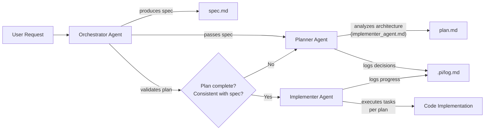
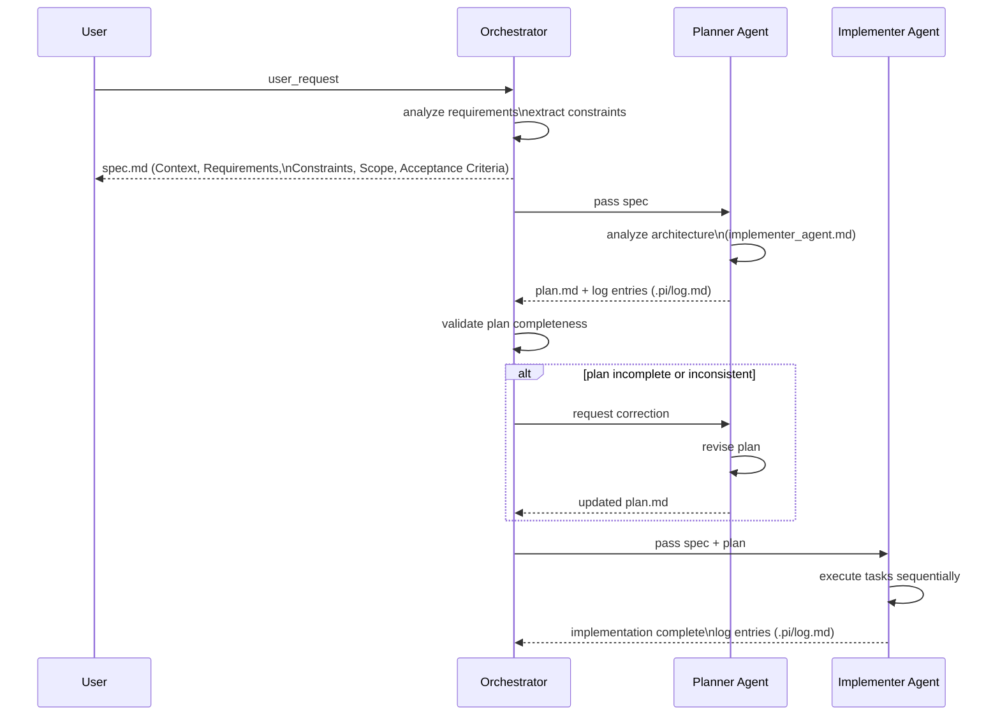

# Orchestrator Agent

## Trigger

Initiated when a new user input or requirement arrives for processing.

## Description

The main workflow orchestrator. Receives the user request, analyzes it, and produces a structured `spec` (following the `.pi/specs/spec_exemple/` pattern). Then coordinates the flow between agents:

1. **Produces the spec** based on the user input — follows the structure of Context, Requirements, Constraints, Scope (In/Out), and Acceptance Criteria.
2. **Calls the planner-agent**, passing the spec as input.
3. **Waits for the plan** to be produced by the planner-agent.
4. **Passes both `spec + plan` to the implementer-agent**, which executes the tasks sequentially according to the plan.

The orchestrator is the only agent responsible for managing the sequence and ensuring each step completes before advancing to the next.

## Workflow

### Step 1 — Generate Spec

- Receives the user requirement.
- Analyzes and extracts requirements, constraints, scope boundaries, and acceptance criteria.
- Produces a `spec` following the pattern defined in `.pi/specs/spec_exemple/example_spec.md`.
- Saves the spec as `spec.md` (or feature name) in the corresponding folder: `.pi/specs/<feature>/`.

### Step 2 — Call Planner Agent

- Passes the generated spec to the planner-agent.
- The planner analyzes the project architecture (`implementer_agent.md`) and produces a structured plan.
- All decisions, assumptions, and spec changes are appended to the single log: `.pi/log.md`.

### Step 3 — Validate Plan

- Verifies that the plan was produced with all mandatory sections (Context, Architecture Alignment, Scope In/Out, Tasks table, Dependencies, Acceptance Criteria).
- If the plan is incomplete or inconsistent with the spec, requests correction from the planner.

### Step 4 — Call Implementer Agent

- Passes **both**: the original spec + the produced plan.
- The implementer-agent executes tasks sequentially according to the plan.
- Each completed task is logged in `.pi/log.md`.

## Output

| Stage | Artifact | Destination |
|---|---|---|
| Generated spec | `spec.md` (or feature name) | `.pi/specs/<feature>/` |
| Produced plan | `plan.md` | `.pi/specs/<feature>/` |
| Decision log | Appends to `.pi/log.md` | Project root |

## Agent Sequence Flow

## Capabilities

- **requirement_analysis** — analyze user input and extract clear, actionable requirements.
- **specification_generation** — produce a structured spec following the `spec_exemple/` pattern.
- **scope_definition** — define In/Out scope boundaries in the spec.
- **constraint_extraction** — identify technical and business constraints.
- **workflow_coordination** — manage the sequence: orchestrator → planner → implementer.
- **plan_validation** — verify plan completeness and consistency before passing to implementation.
- **artifact_routing** — save artifacts at correct paths (`specs/`, `log.md`).

## Architecture Rules (from implementer_agent.md)

The orchestrator must ensure the generated spec aligns with the project architecture:

### Layered Structure
- The spec must indicate which layers are affected (Presentation, Domain, Data).
- Must respect module and core separation.

### RPC-First Rule
- The spec must mention whether an existing RPC covers the operation or if a new one needs to be created.
- If the implementer-agent identifies that no RPC exists, the orchestrator must log this and pause for backend creation.

### Pattern Alignment
- The spec must clarify when Result Pattern, Command Pattern, or Repository Pattern are required.
- The planner-agent uses these details to decompose tasks correctly.

## Config

| Property | Value |
|---|---|
| model | default |
| temperature | 0.3 |
| max_tokens | 4096 |
